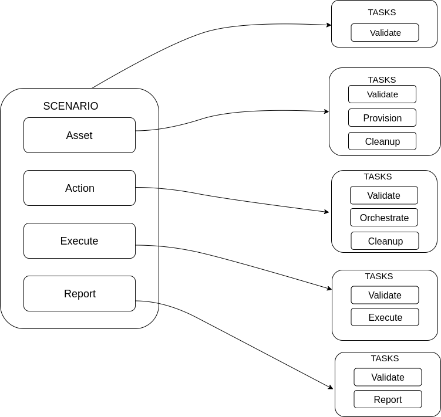

Architecture
============

This page is intended to explain the architecture behind carbon. We strongly
recommend that you review the `scenario descriptor
<../users/scenario_descriptor.html>`_ since it will be helpful when following
this document.

Basics
------

Lets first start with the basics. Carbon is driven by an input file
(scenario descriptor). This input file defines the E2E scenario to be
processed. Within the file, there are multiple task definitions defined. Each
task definition contains resources. These resources will be executed against
that given task. This will be explained in further detail shortly below.
(Hang tight!)

Each carbon execution creates a carbon object. This object acts as the
centralized object: **carbon compound** for the scenario. In chemistry terms:
a carbon molecule constructs compounds of other molecules. In theory this
translates to how carbon is constructed. The carbon object creates compounds
of resources which those resources have tasks associated to them to be
executed.

Carbon Object
-------------

As we just learned from the `basics <architecture.html#basics>`_ section,
the carbon object contains resources. Each resource has a list of associated
tasks to it. Those tasks will execute the resoures asscoiated to it.

Lets see a diagram with the available resources for a carbon object. The carbon
object is directly the entire scenario.

The diagram above shows the resources that make up a scenario. The table
below describes each resource in more detail.

.. list-table::
    :widths: auto
    :header-rows: 1

    *   - Resource
        - Description

    *   - Asset
        - The asset resources define the system resources for the scenario.
          These can be anything from hosts, virtual networks, storage,
          security keys, etc.

    *   - Action
        - The action resources define the actions to be performed against
          the defined hosts for the scenario. These actions consist of:
          system configuration, product installation, product configuration,
          framework installation and framework configuration. In summary this
          resource provides the scenario with the ability to perform any
          remote actions against the hosts defined.

    *   - Execute
        - The execute resources define the tests to be executed against the
          defined host resources.

    *   - Report
        - The report resources defines which reporting and analysis system to
          import test artifacts generated during the execution phase.

Now that we have knowledge about how a carbon object is constructed. Which
includes a number of resources. Lets dive depper into the resources. What do
we mean by this? Every resource has a number of tasks that it can correspond
to.

The diagram above shows the carbon object with resources defined. Each of
those resources then have a list of tasks associated to it. This means that
when carbon runs a scenario, for each task to be processed. It will run the
given resources associated to that given task.

i.e. The host resource has a validate, provision and clean up task. This means
that when carbon runs the validate task it will process that host resource.
When it goes to the provision task, it will process that host resource and
the same for clean up task.

i.e. The action resource has a validate and orchestrate task. This means that
when carbon runs the validate task it will process that action resource. When
it goes to the orchestrate task, it will process that action resource.

This same logic goes for the execute and report resources.

Carbon Pipeline
---------------

In the previous section about `carbon object <architecture.html#carbon-object>`_
we learned about how a carbon object is constructed with resources and tasks.
Every resource could have different tasks. Those tasks are executed in a
certain order which the user can provide.

Lets see a diagram showing the default tasks that will get executed
when running carbon.

The above diagram shows the ordered list from top to bottom of the tasks
carbon will execute.

If no resources are associated to a given task, carbon would skip executing
the task. This provides the user with the ability to control the flow of
their scenario.

Plug And Play
-------------

Carbon was developed with the OO programming model which allows it to be
easily extended. This means carbon is very flexible at being able to
interface with various applications. The best way to explain this is to go
through a couple examples. First we will look at how this relates to host
resources and the provision task.

Every host resource defined within a carbon object has an associated provider
to it. This provider is where the host will live. It also has the ability to
specificy a provisioner to use to fulfill the host request in the given
provider. This allows the user to select different tools to handle the
provision task request.

.. code-block:: bash

    carbon/provisioners
    ├── beaker.py
    ├── ext
    │   └── __init__.py
    ├── __init__.py
    ├── openshift.py
    └── openstack.py

.. code-block:: yaml

    ---
    name: demo
    description: demo

    provision:
        - name: machine1
          provisioner: openstack        # provisioner name
          provider:
            name: openstack
            credential: openstack-creds
            image: image1
            flavor: flavor
            networks:
              - network
            floating_ip_pool: 0.0.0.0
            keypair: keypair
          role: role

The above code snippets demonstrate how from the host resource definition
defined within the scenario descriptor file. It tells carbon that it would like
it to use the default openstack provisioner. With this flexibility users could
provide their own module to provision and define this as the provisioner for
their given host resource.

The implementation for users to plug in their own provisioner is currently
not supported yet. But can be in the near future.

Here is an example based on a custom provisioner module:

.. code-block:: bash

    carbon/provisioners
    ├── beaker.py
    ├── ext
    │   └── __init__.py
    ├── __init__.py
    ├── openshift.py
    ├── openstack.py
    └── provisioner_xyz.py

.. code-block:: yaml

    ---
    name: demo
    description: demo

    provision:
        - name: machine1
          provisioner: provisioner_xyz        # provisioner name
          provider:
            name: openstack
            credential: openstack-creds
            image: image1
            flavor: flavor
            networks:
              - network
            floating_ip_pool: 0.0.0.0
            keypair: keypair
          role: role

This also applies to the other resources within the carbon object. Lets look
at the action resource. This resources main purpose is to perform configuration
actions. To do configuration there are a lot of tools that currently exists
to perform these actions. By default carbon supports the ansible orchestrator
out of the box. This can easily be plugged in to use a different orchestrator.

Here is an example with an action resource using the default ansible
orchestrator by carbon.

.. code-block:: bash

    carbon/orchestrators/
    ├── _ansible.py
    ├── _chef.py
    ├── ext
    │   └── __init__.py
    ├── __init__.py
    └── _puppet.py

.. code-block:: yaml

    ---
    name: demo
    description: demo

    provision:
        - name: machine1
          provisioner: openstack
          provider: openstack
            credential: openstack
            image: image1
            flavor: flavor
            networks:
              - network
            floating_ip_pool: 0.0.0.0
            keypair: keypair
          role: role

    orchestrate:
        - name: rhn_subscribe
          orchestrator: ansible         # orchestrator name
          hosts:
            - machine1
          vars:
            rhn_hostname: <hostname>
            rhn_user: <user>
            rhn_password: <password>

It can easily be extended to work with other various orchestrators.

Conclusion
----------

Hopefully after reading this document you were able to have a better
understanding on how carbon was designed. To gain an even deeper understanding
on how it works. We highly recommend following the `development <development.html>`_
document to step through the code.
